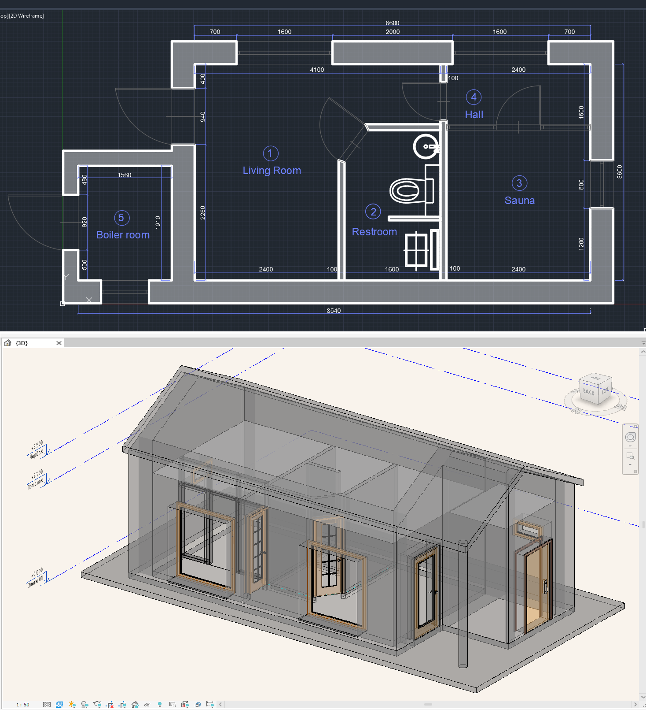
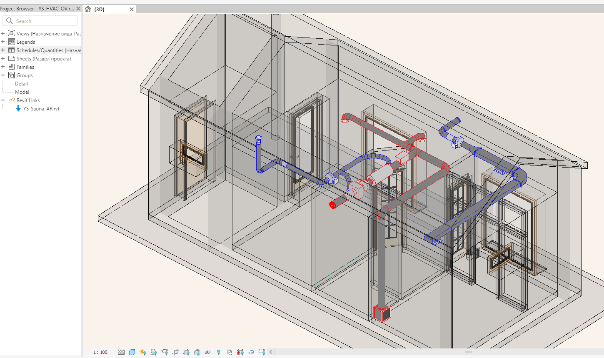
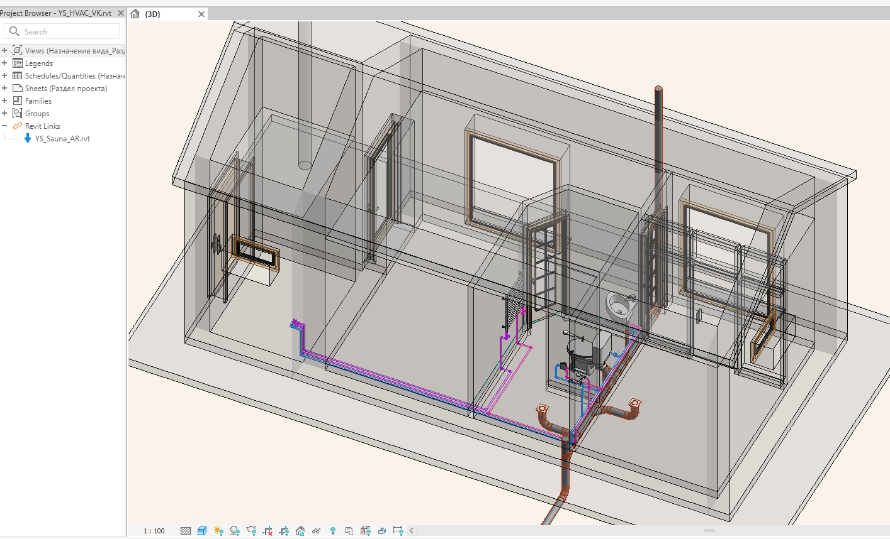
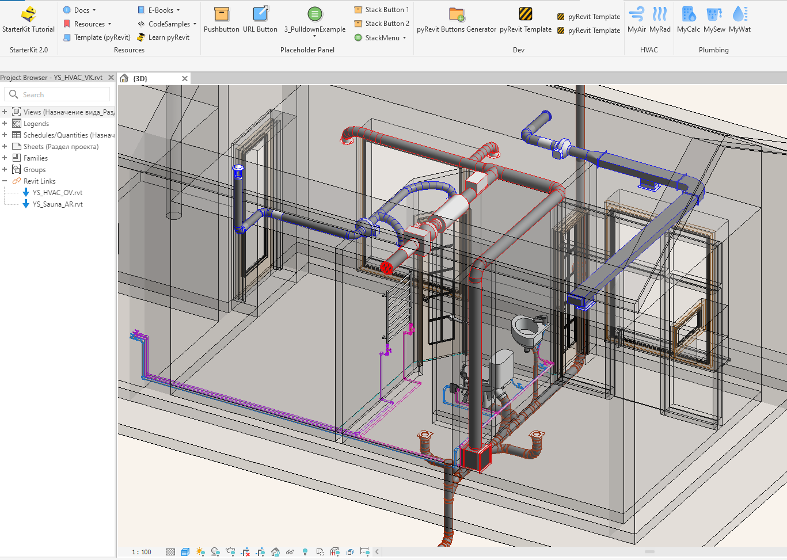
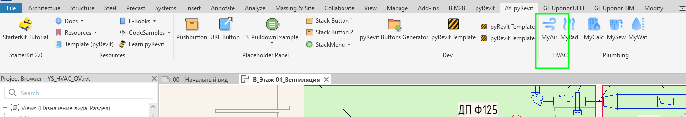
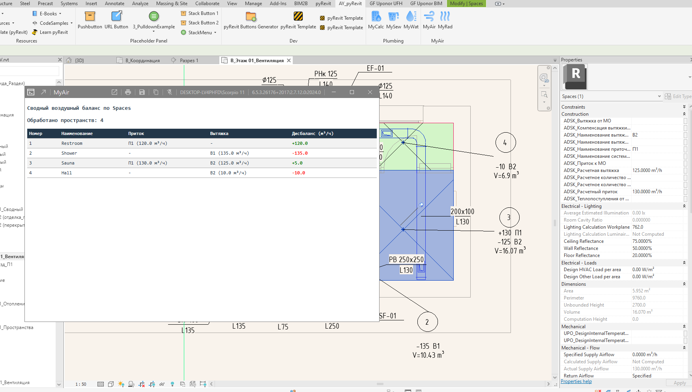

# End-to-End MEP Automation & BIM Data Management Case Study

## What this project demonstrates
- Engineering calculations and system design
- Multi-disciplinary Revit coordination
- Structured BIM data
- Python/pyRevit automation
- Integration of engineering calculations into the BIM workflow

## 1. Engineering Calculations & Technical Scope
- **Airflow & Ductwork Design (MyAir):** Performed thermal and airflow calculations for sauna spaces, treatment rooms, and support areas, including duct and grille sizing to maintain required air exchange, comfort, and humidity control.

- **Hydraulic & Drainage Systems:** Designed water supply and wastewater systems, including pipe sizing, drainage slopes, and fixture connections.

- **Equipment Selection:** Selected specialized HVAC units and sanitary equipment aligned with operational constraints of high-humidity environments.

## 2. Multi-Disciplinary BIM Coordination
Integrated linked architectural and engineering models within a unified Revit environment:
- **Architectural (AR)**

- **Heating & Ventilation (HVAC/OV)** 

- **Plumbing & Drainage (VK)**

- **Visual Clash Detection & View Control** Configured view templates, scope boxes, level visibilities, and linked model graphic overrides (setting link transparency to ~65%) to improve spatial awareness, facilitate clash detection, and support clearance checks between MEP runs and structural elements.

- **Structured Data:** Used standardized parameter structures to support schedule generation and automated element tracking across MEP systems.

## 3. Built-in Engineering Automation (pyRevit / Python)
To eliminate repetitive manual tasks and minimize human error, custom Python automation tools were integrated into the design environment

### MyAir
- **Features:** Extracts ventilation-system data from the Revit model and generates an air balance table for selected building levels.

### MyCalc, MySew, MyWat
Previously developed tools: MyCalc, MySew, and MyWat formed an earlier family of Python tools for hydraulic, water supply, and wastewater calculations.
Information about these tools is available in the [Revit-MEP-Automation-Tools repository](https://github.com/AniYuna/Revit-MEP-Automation-Tools/tree/main) 

## Status
🚧 MyAir — air balance table generation for selected building levels.

## License
This project is released under the **PolyForm Noncommercial License 1.0.0**.
You are welcome to study the code and use these tools for personal learning and non-commercial engineering work.
Commercial use, redistribution for profit, or inclusion in commercial products requires the author's written permission.
Please retain attribution to the original author.
Copyright © 2026 Yanina Shvaikovska

---

## Tech
- Python
- VS Code
- pyRevit
- Revit API
- AutoCAD
- Autodesk Revit

## Roadmap

### Current tools

- ✅ MyAir — Creation of an air balance table at selected building levels tool

### Planned

- ⏳ MyRad
- ⏳ Additional HVAC engineering tools
- ⏳ Automated engineering reports
- ⏳ BIM quality-control utilities

## About the Project

The purpose of this repository is to explore practical approaches to combining engineering knowledge, BIM data, and Python automation in real MEP workflows.
The project is shared for learning, experimentation, and non-commercial engineering use under the PolyForm Noncommercial License 1.0.0.q